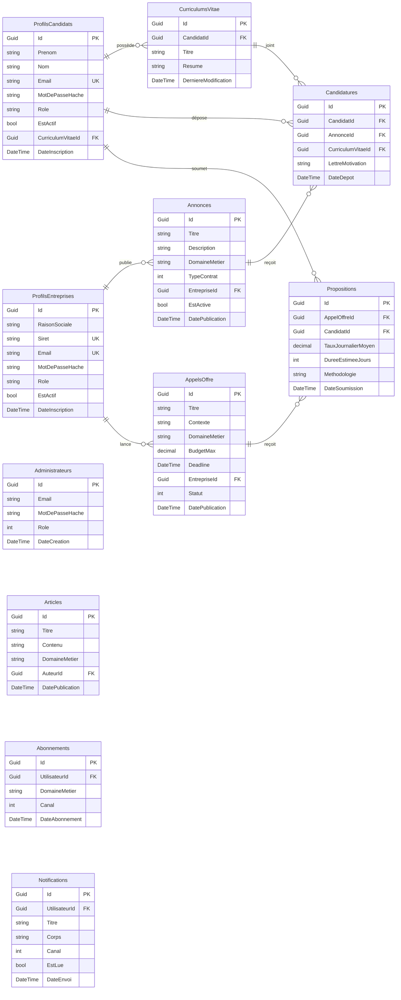
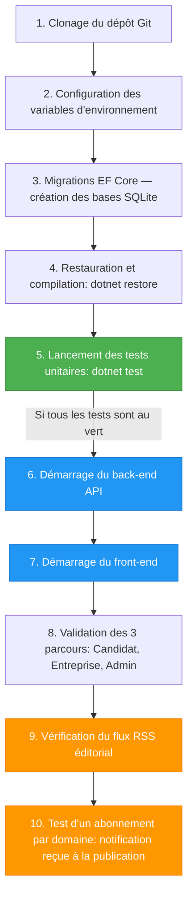

# Plateforme CVTech

Monolithe Modulaire .NET 10 — job board, marketplace freelance, fil d'actualité éditorial et notifications par domaine métier.

## Architecture

4 modules étanches communicant exclusivement via bus d'événements MediatR ou contrats publics :

| Module | Rôle |
|---|---|
| `GestionIdentite` | Authentification JWT, matrice des permissions (`IVerificateurPermission`) |
| `CatalogueEmploi` | Annonces d'emploi, CV, candidatures |
| `AppelOffreFreelance` | Appels d'offre, propositions freelance |
| `ActualiteEtAbonnement` | Articles éditoriaux (RSS), abonnements domaines, notifications |

Chaque module suit la structure : `Client / Application / Domain / Infrastructure / Loader`.

## Schéma de base de données

4 bases SQLite isolées (une par module). Les relations inter-modules sont logiques (pas de FK contraintes en base).



> **Enum stockés comme INTEGER** : `TypeContrat`, `Statut` (AppelOffre), `Canal` (Diffusion)
> **Enum stockés comme STRING** : `Role` dans ProfilsCandidats et ProfilsEntreprises

## Prérequis

- [.NET 10 SDK](https://dotnet.microsoft.com/download)
- [Node.js 20+](https://nodejs.org/)
- Git

> Mode développement : SQLite embarqué — aucune base externe requise.

## Démarrage pas à pas



### 1. Cloner le dépôt

```bash
git clone <url-du-repo>
cd ia-skills
```

### 2. Configuration

Le mode développement utilise SQLite — aucune variable d'environnement obligatoire.

Le fichier `src/CVTech.Api/appsettings.Development.json` contient déjà les valeurs par défaut :

```json
{
  "Jwt": {
    "Secret": "dev-secret-key-at-least-32-chars!!",
    "Issuer": "cvtech-api",
    "Audience": "cvtech-frontend"
  }
}
```

Côté front-end, créer `frontend/.env.local` :

```bash
cp frontend/.env.example frontend/.env.local
# contenu : NEXT_PUBLIC_API_URL=http://localhost:5000
```

### 3. Migrations EF Core (première fois uniquement)

```bash
dotnet tool restore

dotnet ef database update --project src/Modules/GestionIdentite      --startup-project src/CVTech.Api
dotnet ef database update --project src/Modules/CatalogueEmploi      --startup-project src/CVTech.Api
dotnet ef database update --project src/Modules/AppelOffreFreelance   --startup-project src/CVTech.Api
dotnet ef database update --project src/Modules/ActualiteEtAbonnement --startup-project src/CVTech.Api
```

> Les fichiers `.db` sont créés dans `src/CVTech.Api/`.

### 4. Restauration et compilation

```bash
dotnet restore
dotnet build
```

### 5. Tests unitaires

```bash
dotnet test
```

Tous les tests doivent être au vert avant de continuer.

### 6. Démarrage du back-end

```bash
ASPNETCORE_ENVIRONMENT=Development dotnet run --project src/CVTech.Api
```

API disponible sur `http://localhost:5000`.

### 7. Démarrage du front-end

Dans un second terminal :

```bash
cd frontend
npm install
npm run dev
```

Front-end disponible sur `http://localhost:3000`.

---

## Comptes de test

| Rôle | Email | Mot de passe |
|---|---|---|
| Candidat | `llx.kieran@gmail.com` | `Test1234!` |
| Administrateur | `admin@cvtech.fr` | `admin123` |

Pour créer un compte Entreprise : `http://localhost:3000/inscription/entreprise`

---

## Parcours utilisateurs

### Parcours Candidat

1. Inscription : `POST /api/identite/inscription/candidat`
2. Connexion : `POST /api/identite/connexion` → récupérer le JWT
3. Consulter les annonces : `GET /api/annonces` (public)
4. Postuler : `POST /api/annonces/{id}/postuler`
5. Consulter les appels d'offre : `GET /api/appels-offre` (public)
6. Soumettre une proposition : `POST /api/appels-offre/{id}/propositions`
7. S'abonner à un domaine : `POST /api/abonnements`

Interface : `http://localhost:3000/candidat/dashboard`

### Parcours Entreprise

1. Inscription : `POST /api/identite/inscription/entreprise`
2. Publier une annonce : `POST /api/annonces`
3. Publier un appel d'offre : `POST /api/appels-offre`
4. Consulter les candidatures reçues : `GET /api/annonces/{id}/candidatures`

Interface : `http://localhost:3000/entreprise/dashboard`

### Parcours Administrateur

1. Connexion avec `admin@cvtech.fr`
2. Publier un article éditorial : `POST /api/articles`
3. Modérer les annonces : actions de modération disponibles dans le dashboard

Interface : `http://localhost:3000/admin/dashboard`

---

## Flux RSS éditorial

**Endpoint public (aucune authentification requise) :**

```
GET http://localhost:5000/feed/rss
GET http://localhost:5000/feed/rss?domaine=cloud-azure
```

- Format : RSS 2.0 (`application/rss+xml`)
- Contenu : **exclusivement** les articles éditoriaux publiés par les administrateurs
- Ne contient **pas** les annonces d'emploi ni les appels d'offre
- Validable sur [validator.w3.org/feed](https://validator.w3.org/feed/)

---

## Système de notifications par abonnement

Un utilisateur authentifié s'abonne à un domaine métier (`POST /api/abonnements`).

À chaque publication d'annonce ou d'appel d'offre dans ce domaine, le système :

1. Émet `AnnoncePubliee` ou `AppelOffrePublie` via le bus MediatR
2. `SurAnnoncePublieeHandler` / `SurAppelOffrePublieHandler` récupèrent les abonnés du domaine
3. `IServiceNotification` envoie la notification (canal `InApp` en développement — persistée en base)

Consulter ses notifications : `GET /api/notifications`

---

## AI Skills

Les règles architecturales pour l'assistant IA sont dans `.claude/skills/` :

| Fichier | Rôle |
|---|---|
| `architecture-monolithe.md` | Structure 5 couches, étanchéité des modules, nommage |
| `regles-permission.md` | Vérification `IVerificateurPermission` avant toute action |
| `regles-tdd.md` | Cycle Red-Green-Refactor, xUnit + FluentAssertions, nommage français |
| `regles-bus-evenements.md` | Communication inter-modules via MediatR `INotification` |
| `regles-rss.md` | Contraintes du flux RSS 2.0 éditorial |
| `regles-notifications.md` | Abonnements, ciblage des abonnés, canaux de diffusion |
| `regles-module-gestion-identite.md` | Matrice des permissions, `IVerificateurPermission` |


## Login Admin
admin@cvtech.fr
admin123